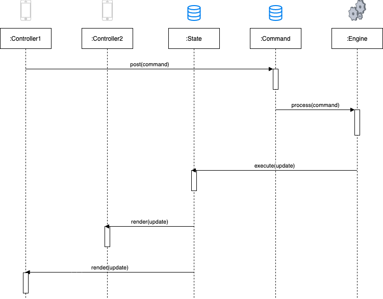

# WildWest

This is an iOS visual implementation of the *[Bang!](https://en.wikipedia.org/wiki/Bang!_(card_game))* card game, a Wild West-themed social deduction card game designed by Emiliano Sciarra and published by DaVinci.

The aim of this project is only educational: exploring AI algorithms, scripting rules, evaluating Game Engine performance, online game matching.

## Features 

- Implements the same rules as the classic Bang!
- Single player agains AI put in the same conditions as real player
- Multiplayer powered by Firebase Realtime Database

## Installation

You wil need

- XCode 12+
- Device or Simulator on iOS 9.3+

1. [Install CocoaPods](https://guides.cocoapods.org/using/getting-started.html#toc_3) on your computer
2. Run `$ pod install` in the project directory
3. Open `WildWest.xcworkspace` and build

## Architecture

## Rights

*Game idea, development, design, artwork, packaging, the BANG! name and logo are all 
Copyright, and Trademarks or Registered Trademarks of DaVinci Editrice S.r.l all Rights Reserved*

## Contributing
Pull requests are welcome. For major changes, please open an issue first to discuss what you would like to change.

Please make sure to update tests as appropriate.

## Additional Resouces
- [Engine](./ENGINE.md)
- [Changelog](./CHANGELOG.md)

## License
[MIT](https://choosealicense.com/licenses/mit/)
